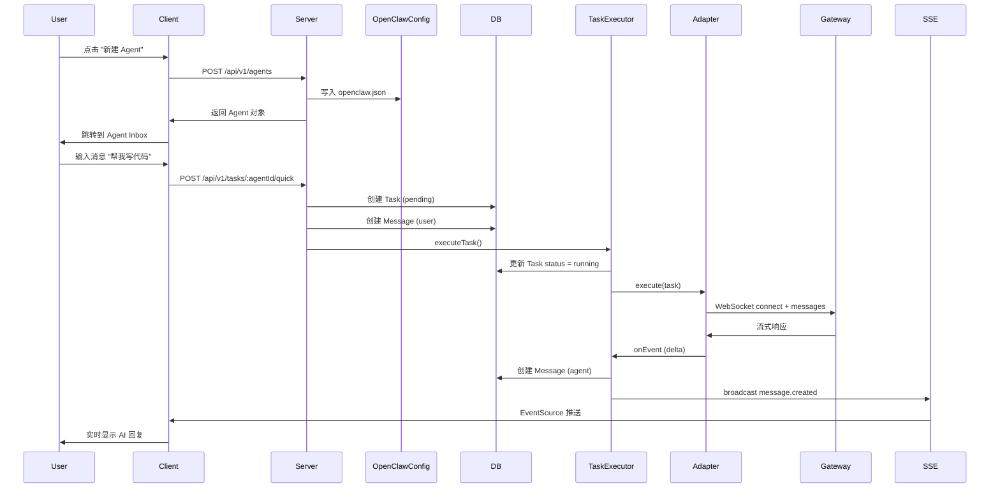

# BridgeTalk 架构设计

本文档详细说明 BridgeTalk 的系统架构、数据模型和技术选型。

---

## 📐 系统架构

### 整体架构

BridgeTalk 采用**本地优先**的三层架构设计：

```
┌─────────────────────────────────────────────────────────┐
│                    Client (React)                        │
│  ┌────────────┐  ┌────────────┐  ┌────────────┐        │
│  │ Agent List │  │ Task Inbox │  │ Task Detail│        │
│  └────────────┘  └────────────┘  └────────────┘        │
│         │                │                │             │
│         └────────────────┴────────────────┘             │
│                         │                                │
│                   API Client + SSE                       │
└──────────────────────────┬──────────────────────────────┘
                           │ HTTP + SSE
┌──────────────────────────▼──────────────────────────────┐
│                    Server (Express)                      │
│  ┌─────────────────────────────────────────────────┐   │
│  │ REST API (CRUD Tasks, Messages, Agents)         │   │
│  └────────────┬────────────────────────────────────┘   │
│  ┌────────────▼────────────────────────────────────┐   │
│  │ Task Executor (执行引擎)                         │   │
│  │  - 任务生命周期管理                               │   │
│  │  - 消息路由                                       │   │
│  │  - 子任务创建                                     │   │
│  └────────────┬────────────────────────────────────┘   │
│  ┌────────────▼────────────────────────────────────┐   │
│  │ OpenClaw Adapter (Gateway 适配器)                │   │
│  │  - WebSocket 连接管理                            │   │
│  │  - 设备身份认证                                   │   │
│  │  - 协议转换                                       │   │
│  └────────────┬────────────────────────────────────┘   │
│               │                                          │
│  ┌────────────▼────────────────────────────────────┐   │
│  │ Repository (SQLite)                              │   │
│  │  - tasks 表                                      │   │
│  │  - messages 表                                   │   │
│  └──────────────────────────────────────────────────┘   │
└──────────────────────────┬──────────────────────────────┘
                           │ WebSocket
┌──────────────────────────▼──────────────────────────────┐
│              OpenClaw Gateway (外部依赖)                 │
│  - AI 模型路由                                           │
│  - 会话管理                                              │
│  - 流式输出                                              │
└──────────────────────────────────────────────────────────┘
```

---

## 🗂️ 数据模型

### 核心实体

#### 1. Agent（智能体）

```typescript
interface Agent {
  id: string;              // ULID
  name: string;            // 显示名称，如 "助手"
  model: string;           // AI 模型名，如 "claude-opus-4-6"
  systemPrompt?: string;   // 系统提示词
  createdAt: number;       // 创建时间戳（毫秒）
}
```

**存储位置**：`packages/server/openclaw.json`（不在数据库）

**设计原因**：
- Agent 配置需要与 OpenClaw Gateway 同步
- 修改频率极低（创建后基本不变）
- 避免数据库和配置文件不一致

#### 2. Task（任务）

```typescript
interface Task {
  id: string;                     // ULID
  agentId: string;                // 所属 agent
  title: string;                  // 任务标题
  description?: string;           // 任务描述
  status: TaskStatus;             // 状态
  priority?: 'P0' | 'P1' | 'P2'; // 优先级（暂未使用）
  createdAt: number;              // 创建时间
  updatedAt: number;              // 更新时间
  completedAt?: number;           // 完成时间
  parentTaskId?: string;          // 父任务 ID（子任务）
}

type TaskStatus = 'pending' | 'running' | 'completed' | 'failed' | 'cancelled';
```

**状态机**：

```
pending ──→ running ──→ completed
                │
                └──→ failed
                │
                └──→ cancelled
```

**数据库表**：

```sql
CREATE TABLE tasks (
  id TEXT PRIMARY KEY,
  agent_id TEXT NOT NULL,
  title TEXT NOT NULL,
  description TEXT,
  status TEXT NOT NULL DEFAULT 'pending',
  priority TEXT,
  created_at INTEGER NOT NULL,
  updated_at INTEGER NOT NULL,
  completed_at INTEGER,
  parent_task_id TEXT,
  FOREIGN KEY (parent_task_id) REFERENCES tasks(id)
);

CREATE INDEX idx_tasks_agent_status ON tasks(agent_id, status);
CREATE INDEX idx_tasks_parent ON tasks(parent_task_id);
```

#### 3. Message（消息）

```typescript
interface Message {
  id: string;                          // ULID
  taskId: string;                      // 所属任务
  senderType: 'user' | 'agent' | 'system';
  content: string;                     // 消息内容
  timestamp: number;                   // 时间戳
}
```

**数据库表**：

```sql
CREATE TABLE messages (
  id TEXT PRIMARY KEY,
  task_id TEXT NOT NULL,
  sender_type TEXT NOT NULL,
  content TEXT NOT NULL,
  timestamp INTEGER NOT NULL,
  FOREIGN KEY (task_id) REFERENCES tasks(id) ON DELETE CASCADE
);

CREATE INDEX idx_messages_task ON messages(task_id, timestamp);
```

---

## 🔄 核心流程

### 1. 创建 Agent 并开始对话



### 2. 子任务创建（多 Agent 协作）

当主 Agent 需要委托子任务给其他 Agent 时：

```
1. 主 Agent 发送 coordination 消息（包含 target_agent）
2. TaskExecutor 解析 coordination 数据
3. 创建子任务（parentTaskId = 主任务 ID）
4. 启动子 Agent 执行子任务
5. 子任务完成后，结果写回主任务的对话
```

**示例**：

```
主任务：写一个完整的博客文章
  ├─ 子任务 1：由 writer agent 撰写初稿
  ├─ 子任务 2：由 qa agent 校对错误
  └─ 子任务 3：由 coder agent 添加代码示例
```

### 3. 实时通信（SSE）

**全局事件流**：`GET /api/v1/events`

```typescript
// 客户端
const eventSource = new EventSource('/api/v1/events');

eventSource.addEventListener('task.created', (e) => {
  const { task } = JSON.parse(e.data);
  // 更新任务列表
});

eventSource.addEventListener('task.updated', (e) => {
  const { task } = JSON.parse(e.data);
  // 更新任务状态
});

eventSource.addEventListener('message.created', (e) => {
  const { taskId, message } = JSON.parse(e.data);
  // 添加新消息
});
```

**任务级别事件流**：`GET /api/v1/tasks/:id/events`

用于单个任务的详细日志和中间结果。

---

## 🔌 OpenClaw Gateway 集成

### WebSocket 协议 v3

BridgeTalk 通过 WebSocket 连接到 OpenClaw Gateway，使用自定义的 RPC 协议。

#### 连接流程

```
1. Client → Server: WebSocket handshake
2. Server → Gateway: send challenge.get (请求挑战值)
3. Gateway → Server: response (包含 nonce)
4. Server: 使用私钥签名 nonce
5. Server → Gateway: send session.connect (包含签名)
6. Gateway: 验证签名
7. Gateway → Server: response (success, 返回 sessionKey)
8. 连接建立，可以发送 messages.send
```

#### 主要 RPC 方法

| 方法 | 说明 |
|------|------|
| `challenge.get` | 获取身份验证挑战值 |
| `session.connect` | 建立会话连接 |
| `messages.send` | 发送消息并获取 AI 响应 |
| `session.close` | 关闭会话 |

#### 消息格式

**请求**：

```json
{
  "type": "req",
  "id": "01HX...",
  "method": "messages.send",
  "params": {
    "sessionKey": "agent:main:xxx",
    "messages": [
      { "role": "user", "content": "你好" }
    ]
  }
}
```

**响应**：

```json
{
  "type": "res",
  "id": "01HX...",
  "result": {
    "state": "final",
    "message": {
      "role": "assistant",
      "content": "你好！我是 AI 助手..."
    }
  }
}
```

### 设备身份管理

每个 BridgeTalk 实例会生成唯一的**设备身份**：

- **设备 ID**：UUID
- **公钥/私钥对**：EdDSA (Ed25519)
- **存储位置**：`packages/server/openclaw-device/`

首次连接时：
1. Gateway 验证签名
2. 返回 **device token**（有效期 30 天）
3. 后续连接优先使用 device token（更快）

---

## 📊 前端架构

### 状态管理

使用 **React Context + Hooks**（不使用 Redux）：

```typescript
// lib/store.tsx
interface AppState {
  agents: Agent[];
  tasks: Task[];
  messages: Record<string, Message[]>; // taskId → messages
}

const AppContext = createContext<AppState>(null);

export function useAgents() { ... }
export function useTasks(agentId: string) { ... }
export function useMessages(taskId: string) { ... }
```

### 路由设计

```
/                          → AgentListPage（所有 agents）
/agents/:agentId           → AgentInboxPage（该 agent 的任务列表 + 对话）
/agents/:agentId/tasks/:taskId → TaskDetailPage（单个任务详情）
```

**特点**：
- 移动优先，单页应用
- 使用 React Router 的 `useParams()` 获取路由参数
- 支持浏览器前进/后退

### SSE 连接管理

```typescript
// lib/api.ts
export function connectSSE(onEvent: (event: SSEEvent) => void) {
  const es = new EventSource('/api/v1/events');

  es.addEventListener('task.created', (e) => {
    onEvent({ type: 'task.created', data: JSON.parse(e.data) });
  });

  // ... 其他事件

  return () => es.close();
}
```

**错误处理**：
- SSE 断开时自动重连（浏览器默认行为）
- 支持 `Last-Event-ID` 恢复断点

---

## 🔐 安全设计

### 1. 本地优先

- 所有数据存储在本地 SQLite
- 不依赖云服务
- 不收集用户数据

### 2. Token 保护

- OpenClaw Gateway Token 存储在 `.env` 文件
- `.env` 文件已被 `.gitignore` 排除
- 不在客户端代码中暴露 token

### 3. SQL 注入防护

使用参数化查询：

```typescript
// ❌ 错误
db.prepare(`SELECT * FROM tasks WHERE id = '${taskId}'`);

// ✅ 正确
db.prepare('SELECT * FROM tasks WHERE id = ?').get(taskId);
```

### 4. XSS 防护

- React 默认转义输出
- Markdown 渲染使用 sanitize（计划中）

---

## 🚀 性能优化

### 1. 数据库索引

```sql
-- 高频查询优化
CREATE INDEX idx_tasks_agent_status ON tasks(agent_id, status);
CREATE INDEX idx_messages_task ON messages(task_id, timestamp);
```

### 2. SSE 事件过滤

- 全局事件流：所有任务的状态变化
- 任务级别事件流：单个任务的详细日志
- 客户端根据当前页面订阅相应的流

### 3. 前端优化

- 使用 Vite 的代码分割
- 静态资源（JS/CSS）哈希命名 + 长期缓存
- PWA 离线缓存

---

## 🔄 扩展性设计

### 1. Adapter 抽象层

```typescript
interface Adapter {
  execute(task: Task): Promise<void>;
  getHealth(): Promise<HealthStatus>;
}
```

未来可以支持其他 AI 平台：
- OpenAI API Adapter
- Claude API Adapter
- 本地模型 Adapter

### 2. 插件化工具

计划支持自定义工具（MCP 协议）：
- 文件系统操作
- 浏览器自动化
- 数据库查询
- ...

### 3. 多设备同步（未来）

当前是**完全本地**，未来可选：
- 通过 Git 同步数据库
- 使用 P2P 协议（如 CRDT）
- 自建同步服务

---

## 📚 技术选型理由

| 技术 | 选择理由 |
|------|---------|
| **React** | 组件化、生态成熟、PWA 支持好 |
| **TypeScript** | 类型安全、IDE 友好、减少 bug |
| **Tailwind CSS** | 快速开发、一致性好、文件小 |
| **Vite** | 极速构建、HMR 快、开发体验佳 |
| **Express** | 简单、灵活、中间件丰富 |
| **better-sqlite3** | 同步 API、性能好、无需额外服务 |
| **ULID** | 时间排序、URL 友好、分布式 ID |
| **pnpm** | 磁盘高效、monorepo 支持好 |

---

## 🤔 设计权衡

### 为什么不用 PostgreSQL？

- **优势**：功能更强大、支持并发写入
- **劣势**：需要额外安装、配置复杂
- **结论**：SQLite 足够满足单用户本地应用需求

### 为什么不用 Redux？

- **优势**：强大的状态管理、时间旅行调试
- **劣势**：样板代码多、学习曲线陡
- **结论**：Context + Hooks 足够简单，满足需求

### 为什么 Agent 不存数据库？

- **问题**：Agent 配置需要同步到 `openclaw.json`
- **方案 A**：同时维护 DB 和 JSON（容易不一致）
- **方案 B**：只用 JSON，API 直接读写
- **结论**：选择方案 B，Agent 配置很少变更

---

## 📈 未来规划

- [ ] Markdown 渲染和代码高亮
- [ ] 文件上传和附件管理
- [ ] 任务标签和分类
- [ ] 搜索和过滤
- [ ] 数据导出（JSON/Markdown）
- [ ] MCP 工具集成
- [ ] 移动端原生应用（React Native）

---

<div align="center">
  <p>如有疑问，欢迎提 Issue 讨论</p>
</div>
