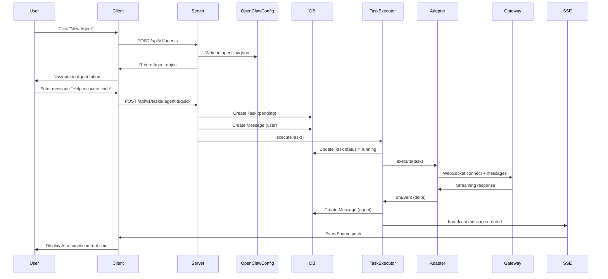

# BridgeTalk Architecture Design

This document details the system architecture, data models, and technology stack of BridgeTalk.

---

## 📐 System Architecture

### Overall Architecture

BridgeTalk adopts a **local-first** three-tier architecture design:

```
┌─────────────────────────────────────────────────────────┐
│                    Client (React)                        │
│  ┌────────────┐  ┌────────────┐  ┌────────────┐        │
│  │ Agent List │  │ Task Inbox │  │ Task Detail│        │
│  └────────────┘  └────────────┘  └────────────┘        │
│         │                │                │             │
│         └────────────────┴────────────────┘             │
│                         │                                │
│                   API Client + SSE                       │
└──────────────────────────┬──────────────────────────────┘
                           │ HTTP + SSE
┌──────────────────────────▼──────────────────────────────┐
│                    Server (Express)                      │
│  ┌─────────────────────────────────────────────────┐   │
│  │ REST API (CRUD Tasks, Messages, Agents)         │   │
│  └────────────┬────────────────────────────────────┘   │
│  ┌────────────▼────────────────────────────────────┐   │
│  │ Task Executor (Execution Engine)                 │   │
│  │  - Task lifecycle management                     │   │
│  │  - Message routing                               │   │
│  │  - Subtask creation                              │   │
│  └────────────┬────────────────────────────────────┘   │
│  ┌────────────▼────────────────────────────────────┐   │
│  │ OpenClaw Adapter (Gateway Adapter)               │   │
│  │  - WebSocket connection management               │   │
│  │  - Device identity authentication                │   │
│  │  - Protocol conversion                           │   │
│  └────────────┬────────────────────────────────────┘   │
│               │                                          │
│  ┌────────────▼────────────────────────────────────┐   │
│  │ Repository (SQLite)                              │   │
│  │  - tasks table                                   │   │
│  │  - messages table                                │   │
│  └──────────────────────────────────────────────────┘   │
└──────────────────────────┬──────────────────────────────┘
                           │ WebSocket
┌──────────────────────────▼──────────────────────────────┐
│              OpenClaw Gateway (External Dependency)      │
│  - AI model routing                                      │
│  - Session management                                    │
│  - Streaming output                                      │
└──────────────────────────────────────────────────────────┘
```

---

## 🗂️ Data Models

### Core Entities

#### 1. Agent

```typescript
interface Agent {
  id: string;              // ULID
  name: string;            // Display name, e.g., "Assistant"
  model: string;           // AI model name, e.g., "claude-opus-4-6"
  systemPrompt?: string;   // System prompt
  createdAt: number;       // Creation timestamp (milliseconds)
}
```

**Storage Location**: `packages/server/openclaw.json` (not in database)

**Design Rationale**:
- Agent configuration needs to be synchronized with OpenClaw Gateway
- Very low modification frequency (rarely changed after creation)
- Avoid inconsistency between database and configuration file

#### 2. Task

```typescript
interface Task {
  id: string;                     // ULID
  agentId: string;                // Owning agent
  title: string;                  // Task title
  description?: string;           // Task description
  status: TaskStatus;             // Status
  priority?: 'P0' | 'P1' | 'P2'; // Priority (currently unused)
  createdAt: number;              // Creation time
  updatedAt: number;              // Update time
  completedAt?: number;           // Completion time
  parentTaskId?: string;          // Parent task ID (for subtasks)
}

type TaskStatus = 'pending' | 'running' | 'completed' | 'failed' | 'cancelled';
```

**State Machine**:

```
pending ──→ running ──→ completed
                │
                └──→ failed
                │
                └──→ cancelled
```

**Database Table**:

```sql
CREATE TABLE tasks (
  id TEXT PRIMARY KEY,
  agent_id TEXT NOT NULL,
  title TEXT NOT NULL,
  description TEXT,
  status TEXT NOT NULL DEFAULT 'pending',
  priority TEXT,
  created_at INTEGER NOT NULL,
  updated_at INTEGER NOT NULL,
  completed_at INTEGER,
  parent_task_id TEXT,
  FOREIGN KEY (parent_task_id) REFERENCES tasks(id)
);

CREATE INDEX idx_tasks_agent_status ON tasks(agent_id, status);
CREATE INDEX idx_tasks_parent ON tasks(parent_task_id);
```

#### 3. Message

```typescript
interface Message {
  id: string;                          // ULID
  taskId: string;                      // Owning task
  senderType: 'user' | 'agent' | 'system';
  content: string;                     // Message content
  timestamp: number;                   // Timestamp
}
```

**Database Table**:

```sql
CREATE TABLE messages (
  id TEXT PRIMARY KEY,
  task_id TEXT NOT NULL,
  sender_type TEXT NOT NULL,
  content TEXT NOT NULL,
  timestamp INTEGER NOT NULL,
  FOREIGN KEY (task_id) REFERENCES tasks(id) ON DELETE CASCADE
);

CREATE INDEX idx_messages_task ON messages(task_id, timestamp);
```

---

## 🔄 Core Workflows

### 1. Create Agent and Start Conversation



### 2. Subtask Creation (Multi-Agent Collaboration)

When the main Agent needs to delegate subtasks to other Agents:

```
1. Main Agent sends coordination message (including target_agent)
2. TaskExecutor parses coordination data
3. Create subtask (parentTaskId = main task ID)
4. Start sub-Agent to execute subtask
5. When subtask completes, result is written back to main task conversation
```

**Example**:

```
Main Task: Write a complete blog article
  ├─ Subtask 1: Writer agent drafts the article
  ├─ Subtask 2: QA agent proofreads for errors
  └─ Subtask 3: Coder agent adds code examples
```

### 3. Real-time Communication (SSE)

**Global Event Stream**: `GET /api/v1/events`

```typescript
// Client
const eventSource = new EventSource('/api/v1/events');

eventSource.addEventListener('task.created', (e) => {
  const { task } = JSON.parse(e.data);
  // Update task list
});

eventSource.addEventListener('task.updated', (e) => {
  const { task } = JSON.parse(e.data);
  // Update task status
});

eventSource.addEventListener('message.created', (e) => {
  const { taskId, message } = JSON.parse(e.data);
  // Add new message
});
```

**Task-level Event Stream**: `GET /api/v1/tasks/:id/events`

Used for detailed logs and intermediate results of a single task.

---

## 🔌 OpenClaw Gateway Integration

### WebSocket Protocol v3

BridgeTalk connects to OpenClaw Gateway via WebSocket using a custom RPC protocol.

#### Connection Flow

```
1. Client → Server: WebSocket handshake
2. Server → Gateway: send challenge.get (request challenge value)
3. Gateway → Server: response (containing nonce)
4. Server: Sign nonce using private key
5. Server → Gateway: send session.connect (containing signature)
6. Gateway: Verify signature
7. Gateway → Server: response (success, return sessionKey)
8. Connection established, can send messages.send
```

#### Main RPC Methods

| Method | Description |
|------|------|
| `challenge.get` | Get identity authentication challenge value |
| `session.connect` | Establish session connection |
| `messages.send` | Send message and get AI response |
| `session.close` | Close session |

#### Message Format

**Request**:

```json
{
  "type": "req",
  "id": "01HX...",
  "method": "messages.send",
  "params": {
    "sessionKey": "agent:main:xxx",
    "messages": [
      { "role": "user", "content": "你好" }
    ]
  }
}
```

**Response**:

```json
{
  "type": "res",
  "id": "01HX...",
  "result": {
    "state": "final",
    "message": {
      "role": "assistant",
      "content": "你好！我是 AI 助手..."
    }
  }
}
```

### Device Identity Management

Each BridgeTalk instance generates a unique **device identity**:

- **Device ID**: UUID
- **Public/Private Key Pair**: EdDSA (Ed25519)
- **Storage Location**: `packages/server/openclaw-device/`

On first connection:
1. Gateway verifies signature
2. Returns **device token** (valid for 30 days)
3. Subsequent connections prioritize device token (faster)

---

## 📊 Frontend Architecture

### State Management

Uses **React Context + Hooks** (no Redux):

```typescript
// lib/store.tsx
interface AppState {
  agents: Agent[];
  tasks: Task[];
  messages: Record<string, Message[]>; // taskId → messages
}

const AppContext = createContext<AppState>(null);

export function useAgents() { ... }
export function useTasks(agentId: string) { ... }
export function useMessages(taskId: string) { ... }
```

### Routing Design

```
/                          → AgentListPage (all agents)
/agents/:agentId           → AgentInboxPage (agent's task list + conversation)
/agents/:agentId/tasks/:taskId → TaskDetailPage (individual task details)
```

**Features**:
- Mobile-first, single-page application
- Uses React Router's `useParams()` to get route parameters
- Supports browser forward/back navigation

### SSE Connection Management

```typescript
// lib/api.ts
export function connectSSE(onEvent: (event: SSEEvent) => void) {
  const es = new EventSource('/api/v1/events');

  es.addEventListener('task.created', (e) => {
    onEvent({ type: 'task.created', data: JSON.parse(e.data) });
  });

  // ... other events

  return () => es.close();
}
```

**Error Handling**:
- Automatic reconnection on SSE disconnect (default browser behavior)
- Supports `Last-Event-ID` for resume from breakpoint

---

## 🔐 Security Design

### 1. Local-First

- All data stored in local SQLite
- No cloud service dependency
- No user data collection

### 2. Token Protection

- OpenClaw Gateway Token stored in `.env` file
- `.env` file excluded by `.gitignore`
- Token not exposed in client-side code

### 3. SQL Injection Protection

Using parameterized queries:

```typescript
// ❌ Wrong
db.prepare(`SELECT * FROM tasks WHERE id = '${taskId}'`);

// ✅ Correct
db.prepare('SELECT * FROM tasks WHERE id = ?').get(taskId);
```

### 4. XSS Protection

- React escapes output by default
- Markdown rendering uses sanitize (planned)

---

## 🚀 Performance Optimization

### 1. Database Indexing

```sql
-- High-frequency query optimization
CREATE INDEX idx_tasks_agent_status ON tasks(agent_id, status);
CREATE INDEX idx_messages_task ON messages(task_id, timestamp);
```

### 2. SSE Event Filtering

- Global event stream: status changes for all tasks
- Task-level event stream: detailed logs for individual tasks
- Client subscribes to appropriate stream based on current page

### 3. Frontend Optimization

- Code splitting using Vite
- Static assets (JS/CSS) with hash naming + long-term caching
- PWA offline caching

---

## 🔄 Extensibility Design

### 1. Adapter Abstraction Layer

```typescript
interface Adapter {
  execute(task: Task): Promise<void>;
  getHealth(): Promise<HealthStatus>;
}
```

Future support for other AI platforms:
- OpenAI API Adapter
- Claude API Adapter
- Local Model Adapter

### 2. Pluggable Tools

Planned support for custom tools (MCP protocol):
- File system operations
- Browser automation
- Database queries
- ...

### 3. Multi-Device Sync (Future)

Currently **fully local**, future options:
- Sync database via Git
- Use P2P protocol (e.g., CRDT)
- Self-hosted sync service

---

## 📚 Technology Stack Rationale

| Technology | Rationale |
|------|---------|
| **React** | Component-based, mature ecosystem, good PWA support |
| **TypeScript** | Type safety, IDE-friendly, reduces bugs |
| **Tailwind CSS** | Rapid development, good consistency, small file size |
| **Vite** | Blazing fast build, fast HMR, great dev experience |
| **Express** | Simple, flexible, rich middleware ecosystem |
| **better-sqlite3** | Synchronous API, good performance, no extra service needed |
| **ULID** | Time-sortable, URL-friendly, distributed ID |
| **pnpm** | Disk-efficient, good monorepo support |

---

## 🤔 Design Tradeoffs

### Why Not PostgreSQL?

- **Advantages**: More powerful features, supports concurrent writes
- **Disadvantages**: Requires additional installation, complex configuration
- **Conclusion**: SQLite is sufficient for single-user local application needs

### Why Not Redux?

- **Advantages**: Powerful state management, time-travel debugging
- **Disadvantages**: Lots of boilerplate, steep learning curve
- **Conclusion**: Context + Hooks is simple enough and meets requirements

### Why Not Store Agents in Database?

- **Problem**: Agent configuration needs to sync to `openclaw.json`
- **Option A**: Maintain both DB and JSON (easy to get inconsistent)
- **Option B**: Only use JSON, API reads/writes directly
- **Conclusion**: Choose Option B, Agent configuration rarely changes

---

## 📈 Future Plans

- [ ] Markdown rendering and code highlighting
- [ ] File upload and attachment management
- [ ] Task tags and categorization
- [ ] Search and filtering
- [ ] Data export (JSON/Markdown)
- [ ] MCP tool integration
- [ ] Native mobile app (React Native)

---

<div align="center">
  <p>If you have any questions, feel free to open an Issue for discussion</p>
</div>
